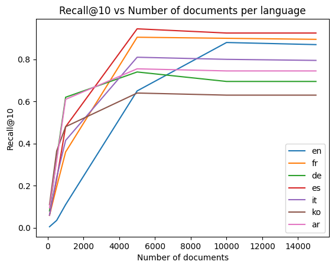
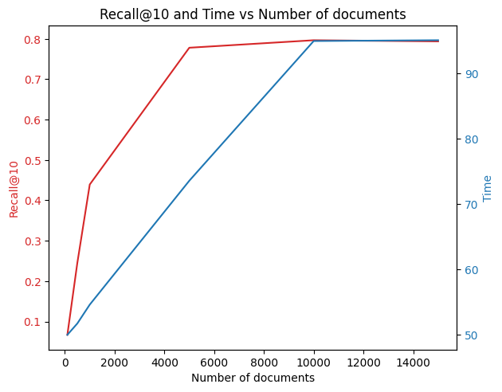
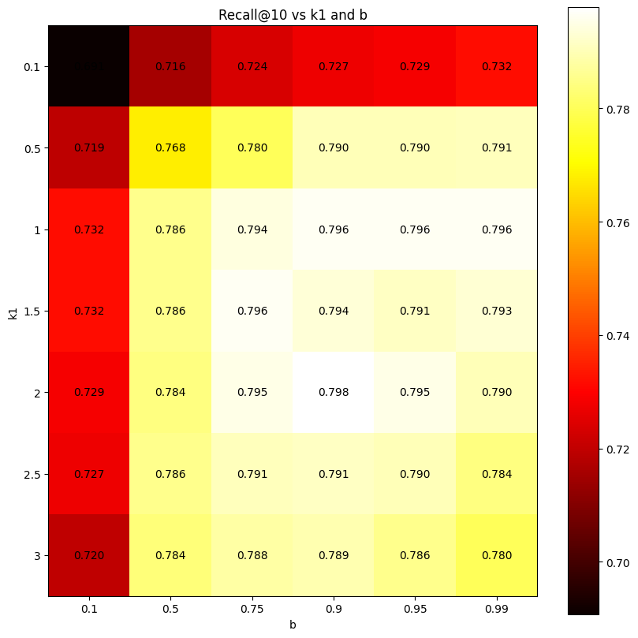

<div align="center">

</div>

<div align="center">
Ecole Polytechnique Fédérale de Lausanne
</div> 
<div align="center">
CS-423 Distributed Information System
</div> 

# Project 1: Document Retrieval

## Table of Contents

- [Abstract](#abstract)
- [Repository Structure](#repository-structure)
- [Data Wrangling](#data-wrangling)
- [Data Processing](#data-processing)
- [Methods](#methods)
- [Results](#results)
- [Contributors](#contributors)

## Abstract
Document retrieval is an important task in text
processing. With the fast expansion of data, it is crucial to have
search engines that can efficiently retrieve documents, given a
set of queries. Retrieval systems are widely used, and probably
the best example is the internet search engine. This report will
explore several retrieval techniques, including word embedding
methods and TF-IDF coupled with the BM25 ranking algorithm.

## Repository structure
The project is structured as follow:
```
.
├── README.md
├── resources
│   ├── fine_tune.png
│   ├── logo-epfl.png
│   ├── recall_per_lang.png
│   ├── recall_time.png
│   ├── recallvsnbdocs.png
│   └── update_all_revisions.py
└── src
    ├── constants.py
    ├── corpus_base.py
    ├── corpus_bm25.py
    ├── corpus_word2vec.py
    ├── kaggle_notebook.ipynb
    ├── main.ipynb
    ├── processing.py
    ├── scores.py
    └── utils.py
```
The notebook *main.ipynb* summarizes the different results obtained. The notebook *kaggle_notebook.ipynb* is a copy of the notebook provided on Kaggle. The only purpose of this notebook is to produce the best prediction. Note that the path of some constants has been changed in order to match the desired paths on Kaggle. The rest of the code is identical to the dedicated files.

- *corpus_word2vec.py* and *corpus_bm25.py* are two classes that computes the prediction using either word2vec or bm25.

## Data Wrangling
There are different data available:\
• corpus.json: This file contains a list of documents, that consti-
tute the database for the retrieval system.\
• *dev.csv*: This File contains a set of queries. The corresponding
positive document and ten negative documents are attached to
these queries. The language of the query is also available.\
• *train.csv*: This file is similar to dev.csv.\
• *test.csv*: This file is the one that should be used for testing the
retrieval system. Only the query, as well as the language is
available in this document.
## Data Processing
These processing steps are performed on the corpus and queries:
1) Tokenizing the text: For this step, the RegexpTokenizer class
from NLTK was used. It removes all characters except letters
and numbers.
2) Converting all words to lowercase: This step ensures that ”Cat”
and ”cat” are not treated as two different words.
3) Applying stemming: Stemming reduces words to their root
form. For example, ”changing”, ”change”, and ”changed” are
all reduced to the root ”chang”. This helps minimize the
vocabulary size and aids in the computation of TF and IDF
values
## Methods
Two methods are presented in this project. One using BM25 ranking and the other one with Word2Vec and cosine similarity. For more information about these two methods, please refer to the project report.
## Results
The best result is obtained using BM25 ranking algorithm. Different optimizations have been performed to increase computation time and performances.
First, to reduce computation time, the relevant documents are reduced. The figure below shows how the number of documents affects the recall.
<p align="center">

</p>
Furthermore, the image below shows the relationship between the number of documents and the time needed to compute the ranking. It can be seen that taking K=10'000 documents is a good compromise between recall and time.

<p align="center">

</p>

Finally the matrix below shows how the parameters $k_1$ and b affects the performances of the BM25 ranking.

<p align="center">

</p>

Based on these three images, the optimal solutions take these parameter values:
- $k_1=2$
- $b=0.9$
- $K=10000$

and gives a recall@10 of 0.8 on the dev set and 0.80074 on the test set (value provided by Kaggle).
## Contributors
This repository has been elaborated by Fabio Palmisano, Yann Cretton and Vincent Roduit during the 2024 fall Semester as a mandatory part of the course *CS-423: Distributed Information Systems*.
